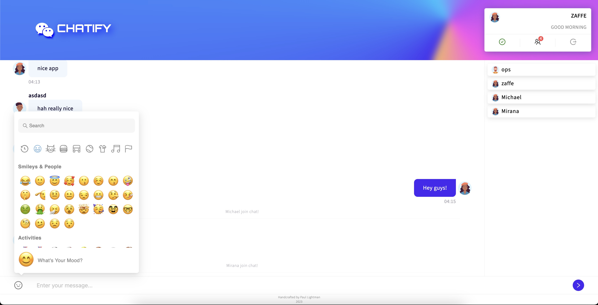

<h3 align="center">Chatify</h3>
<h6 align="center">Full-Stack WebSocket Chat Application</h3>

<h5 align="center">FE: TypeScript, React, Redux, AntD, Axios, Vite, Zod, React-Hook-Forms, etc BE: TypeScript, NestJS, WS Server: Nginx, PM2</h5> 

FE: yarn run dev

BE: yarn dev

<a href="129.159.129.76">Oracle Cloud Preview</a> 

